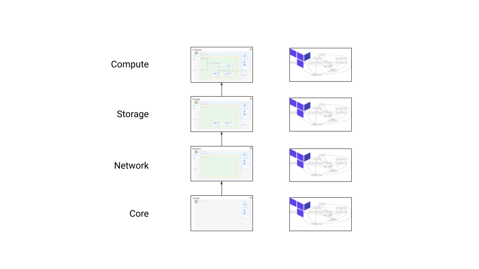

# Terraservices in Google Cloud using Infrastructure Manager

Here are some examples that show how to use Google Cloud's (new)
[Infrastructure Manager](https://cloud.google.com/infrastructure-manager/docs)
to spin up and manage different isolated layers of infrastructure (aka
Terraservices).

Please note that these examples are provided only to help guide infrastructure
planning and are not intended for use in production. They are deliberately
simplified for clarity and lack significant details required for
production-worthy infrastructure implementation.


## Infrastructure Layers

Often large or complex infrastructure needs to accommodate multiple teams each
managing different resources. Terraform-based infrastructure can be organized
into multiple top-level modules that use separate state stores. This
partitioning allows you to control many aspects of infrastructure.  Consider
access for different teams... these teams might be grouped by application, by
infrastructure roles (data -vs- compute), by team types (employee -vs-
contractor), or even by timezone in some cases. You can also handle teams with
different development tempo.  Some teams want the freedom to rapidly evolve app
servers, but don't really need to blow away a database layer with quite the
same regularity. Partitioning infrastructure into different layers also
provides the safety of a limited blast radius for when infrastructure
engineering goes awry. Many small teams even do this for good measure, and
I even do it for small projects because it gives the developers the freedom to
easily and safely delete to a known good state... often blank.

In this example, you'll create:

A "Core" layer containing:
- A dedicated Identity and Access Management (IAM) **Service Account** w/ appropriate
  roles adopting a "Principle of least privilege" approach.
- [optionally] A Customer-Managed Encryption Key (**CMEK**) used to encrypt all storage.

A "Network" layer containing:
- A dedicated **isolated network** with no ingress traffic allowed.

A "Storage" layer containing:
- A **storage node** for convenience during testing.

A "Compute" layer containing:
- And then a **standalone partition of compute nodes**.

Note that these layers build on each other and each have separate state maintained
in a GCS bucket by Infrastructure Manager.




## Costs

If you run the example commands below, you will use billable components of
Google Cloud Platform, including:

- Compute Engine
- Cloud Monitoring
- Cloud Logging
- Cloud KMS

as well as a selection of other services.

You can use the
[Pricing Calculator](https://cloud.google.com/products/calculator)
to generate a cost estimate based on your projected usage.

Check out the [Google Cloud Free
Program](https://cloud.google.com/free/docs/gcp-free-tier) for potential
credits for tutorial resources.

## Before you begin

Start by opening
[https://console.cloud.google.com/](https://console.cloud.google.com/)
in a browser.

Create a new GCP Project using the
[Cloud Resource Manager](https://console.cloud.google.com/cloud-resource-manager).
The project you create is just for this example, so you'll delete it below
when you're done.

You will need to
[enable billing](https://support.google.com/cloud/answer/6293499#enable-billing)
for this project.

You need to enable Compute Engine and Filestore services as enabling these APIs
allows you to create the required resources.

[Enable Example Services](https://console.cloud.google.com/flows/enableapi?apiid=compute.googleapis.com,logging.googleapis.com,monitoring.googleapis.com,cloudresourcemanager.googleapis.com,cloudkms.googleapis.com)
    
Next, make sure the project you just created is selected in the top of the
Cloud Console.

Then open a Cloud Shell associated with the project you just created

[Launch Cloud Shell](https://console.cloud.google.com/?cloudshell=true)

It's important that the current Cloud Shell project is the one you just
created.  Verify that

```bash
echo $GOOGLE_CLOUD_PROJECT
```

shows that new project.

All example commands below run from this Cloud Shell.


## Example source

The source code for this example is obtained automatically by Google
Infrastructure Manager in all of the steps below, and is openly provided
<https://github.com/mmm/gcp-infra-manager>.


## Tools

We use Google Cloud
[Infrastructure Manager](https://cloud.google.com/infrastructure-manager/docs),
[CloudShell](https://cloud.google.com/shell), and Hashicorp's
[Terraform](terraform.io) for these examples.  Everything you need should already
be accessible or installed in your GCP Cloudshell.


## Lay down a "Core" layer

Create a Service Account and a Customer-Managed Encryption Keys (CMEK) to use
when we create all of the compute resources used in this project:

Copy and paste the following command into cloud shell and hit return.

```bash
LOCATION="us-central1"
DEPLOYMENT_ID="setup"
SERVICE_ACCOUNT_PROJECT_ID="${GOOGLE_CLOUD_PROJECT}"
SERVICE_ACCOUNT_EMAIL="config-agent@${GOOGLE_CLOUD_PROJECT}.iam.gserviceaccount.com"
GIT_REPO="https://github.com/mmm/gcp-infra-manager"
DIRECTORY="terraform/setup"
INPUTS=project_id=${GOOGLE_CLOUD_PROJECT}

gcloud infra-manager deployments apply \
  "projects/${GOOGLE_CLOUD_PROJECT}/locations/${LOCATION}/deployments/${DEPLOYMENT_ID}" \
  --service-account "projects/${SERVICE_ACCOUNT_PROJECT_ID}/serviceAccounts/${SERVICE_ACCOUNT_EMAIL}" \
  --git-source-repo="${GIT_REPO}" \
  --git-source-directory="${DIRECTORY}" \
  --input-values="${INPUTS}"
```

We'll need to use the service account email in later steps of this tutorial.


## Network

Create a network dedicated to the compute cluster instead of using the `default`
network for the project we created.

Copy and paste the following command into cloud shell and hit return.

```bash
LOCATION="us-central1"
DEPLOYMENT_ID="network"
SERVICE_ACCOUNT_PROJECT_ID="${GOOGLE_CLOUD_PROJECT}"
SERVICE_ACCOUNT_EMAIL="config-agent@${GOOGLE_CLOUD_PROJECT}.iam.gserviceaccount.com"
GIT_REPO="https://github.com/mmm/gcp-infra-manager"
DIRECTORY="terraform/network"
INPUTS=project_id=${GOOGLE_CLOUD_PROJECT}

gcloud infra-manager deployments apply \
  "projects/${GOOGLE_CLOUD_PROJECT}/locations/${LOCATION}/deployments/${DEPLOYMENT_ID}" \
  --service-account "projects/${SERVICE_ACCOUNT_PROJECT_ID}/serviceAccounts/${SERVICE_ACCOUNT_EMAIL}" \
  --git-source-repo="${GIT_REPO}" \
  --git-source-directory="${DIRECTORY}" \
  --input-values="${INPUTS}"
```

This creates a network with egress but no ingress rules.
We'll need the names `tutorial` for the network and subnet in later steps of this tutorial.


## Storage

NFS volumes are common in compute cluster scenarios.  Here we create them just
as an example as well as potentially providing convenience for infrastructure
development and testing.  E.g., shared home directories on compute nodes.

Note that in this part of the example we're using outputs from the `setup` and
`network` steps above.

Copy and paste the following command into cloud shell and hit return.

```bash
LOCATION="us-central1"
DEPLOYMENT_ID="storage"
SERVICE_ACCOUNT_PROJECT_ID="${GOOGLE_CLOUD_PROJECT}"
SERVICE_ACCOUNT_EMAIL="config-agent@${GOOGLE_CLOUD_PROJECT}.iam.gserviceaccount.com"
GIT_REPO="https://github.com/mmm/gcp-infra-manager"
DIRECTORY="terraform/storage"
INPUTS="project_id=${GOOGLE_CLOUD_PROJECT},network=tutorial,subnet=tutorial,zone=us-central1-c"

gcloud infra-manager deployments apply \
  "projects/${GOOGLE_CLOUD_PROJECT}/locations/${LOCATION}/deployments/${DEPLOYMENT_ID}" \
  --service-account "projects/${SERVICE_ACCOUNT_PROJECT_ID}/serviceAccounts/${SERVICE_ACCOUNT_EMAIL}" \
  --git-source-repo="${GIT_REPO}" \
  --git-source-directory="${DIRECTORY}" \
  --input-values="${INPUTS}"
```

Note the output IP addresses reported from the `apply`.

You could now use those terraform outputs to set terraform variables in the
next steps just like we did in this step.  However, we'll take a bit of
a shortcut in the next step and access outputs directly from the terraform
state for previous steps.


## Compute

Create an example static cluster of compute nodes.

Copy and paste the following command into cloud shell and hit return.

```bash
LOCATION="us-central1"
DEPLOYMENT_ID="compute-partition"
SERVICE_ACCOUNT_PROJECT_ID="${GOOGLE_CLOUD_PROJECT}"
SERVICE_ACCOUNT_EMAIL="config-agent@${GOOGLE_CLOUD_PROJECT}.iam.gserviceaccount.com"
GIT_REPO="https://github.com/mmm/gcp-infra-manager"
DIRECTORY="terraform/compute-partition"
STORAGE_NODE_IP=""  # change this!
INPUTS="project_id=${GOOGLE_CLOUD_PROJECT},network=tutorial,subnet=tutorial,zone=us-central1-c,home_volume_ip=${STORAGE_NODE_IP},tools_volume_ip=${STORAGE_NODE_IP}"

gcloud infra-manager deployments apply \
  "projects/${GOOGLE_CLOUD_PROJECT}/locations/${LOCATION}/deployments/${DEPLOYMENT_ID}" \
  --service-account "projects/${SERVICE_ACCOUNT_PROJECT_ID}/serviceAccounts/${SERVICE_ACCOUNT_EMAIL}" \
  --git-source-repo="${GIT_REPO}" \
  --git-source-directory="${DIRECTORY}" \
  --input-values="${INPUTS}"
```

and wait for the resources to be created.  This should only take a minute or two.


## Run a compute-intensive job

Once the cluster is up, you are ready to associate the compute nodes
to a scheduler and run jobs.

Since the cluster has no access to the outside world, the easiest way to
transfer files around is to use a login node. Without a "local" login node, it
might be easiest to transfer files to/from any compute node is to use Google
Cloud Storage (GCS).

Create a bucket in the Cloud Console, add files you need to that bucket, and
then copy them directly from any node in the cluster.

From a node, download any files from GCS using something like

```sh
gsutil ls gs://
gsutil ls gs://<my-cool-bucket-name>/
gsutil cp gs://<my-cool-bucket-name>/<some-filename> .
```

You can then extract and kick off jobs from there.


## Cleaning up

To avoid incurring charges to your Google Cloud Platform account for the
resources used in this tutorial:

### Delete the project using the GCP Cloud Console

The easiest way to clean up all of the resources used in this tutorial is
to delete the project that you initially created for the tutorial.

Caution: Deleting a project has the following effects:
- Everything in the project is deleted. If you used an existing project for
  this tutorial, when you delete it, you also delete any other work you've done
  in the project.
- Custom project IDs are lost. When you created this project, you might have
  created a custom project ID that you want to use in the future. To preserve
  the URLs that use the project ID, such as an appspot.com URL, delete selected
  resources inside the project instead of deleting the whole project.

1. In the GCP Console, go to the Projects page.

    [GO TO THE PROJECTS PAGE](https://console.cloud.google.com/cloud-resource-manager)

2. In the project list, select the project you want to delete and click Delete
   delete.
3. In the dialog, type the project ID, and then click Shut down to delete the
   project.

### Deleting resources using Terraform

Alternatively, if you added the tutorial resources to an _existing_ project, you
can still clean up those resources using Infrastructure Manager.

From the cloud shell, run

```bash
gcloud infra-manager deployments list
```

followed by

```bash
gcloud infra-manager deployment delete compute-partition --location us-central1
gcloud infra-manager deployment delete storage --location us-central1
gcloud infra-manager deployment delete network --location us-central1
gcloud infra-manager deployment delete setup --location us-central1
```

to clean up the rest.


## What's next

There are so many exciting directions to take to learn more about what you've
done here!

- Infrastructure.  Learn more about
  [Cloud](https://cloud.google.com/),
  High Performance Computing (HPC) on GCP
  [reference architectures](https://cloud.google.com/solutions/hpc/) and 
  [posts](https://cloud.google.com/blog/topics/hpc).

